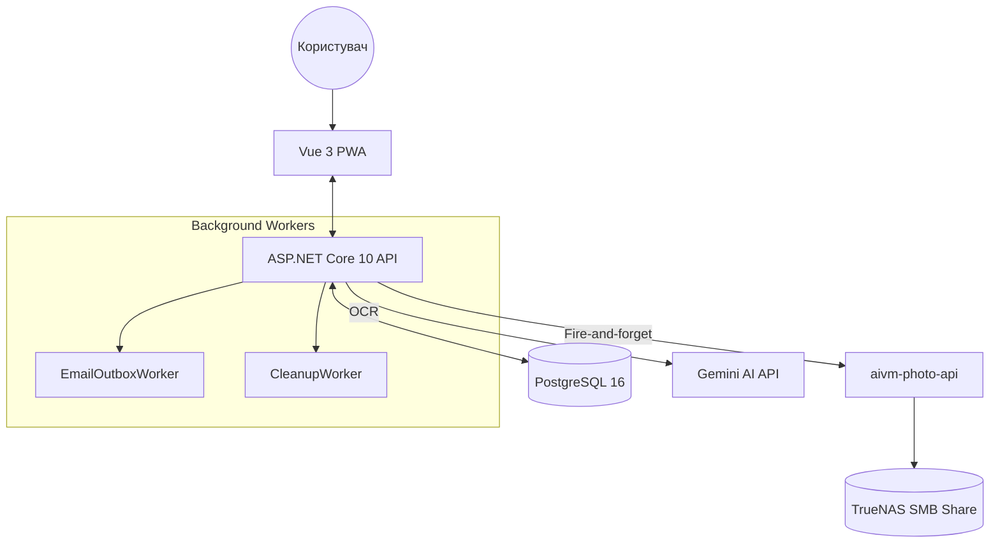

# BP Tracker — Backend

REST API для системи відстеження артеріального тиску. Виступає також проксі до Gemini AI для розпізнавання знімків тонометра та асинхронно пересилає фото у сервіс збору датасету.

## Архітектура системи



## Стек

- **.NET 10** Minimal APIs
- **PostgreSQL 16** + Entity Framework Core 10.0 (Npgsql)
- **Fido2NetLib** — Passkey (WebAuthn) автентифікація
- **MailKit** — відправка email (magic link, CSV export)
- **Serilog** — структуроване JSON-логування
- **Scalar UI** — інтерактивна документація (`/scalar/v1`)
- **Docker + Docker Compose** — розгортання
- **Gemini AI** — OCR знімків тонометра

## Структура проекту

```
├── Data/               AppDbContext, EF Core migrations
├── Models/             Measurement, TreatmentSchema, User, UserSetting,
│                       UserCredential, UserSession, MagicLink, EmailOutbox
├── Services/           IMeasurementService, ISchemaService, IGeminiService,
│                       IAuthService, IEmailSender, IPhotoApiService,
│                       EmailOutboxWorker, CleanupWorker
├── BpTracker.Api.Tests/ Інтеграційні тести (xUnit + Testcontainers)
├── Endpoints/          MeasurementEndpoints, SchemaEndpoints, AnalyzeEndpoints,
│                       AuthEndpoints, SettingsEndpoints, ExportEndpoints
├── Middleware/         SessionMiddleware (читає __Host-session cookie → HttpContext.User)
├── Program.cs          Startup, DI, CORS, Rate Limiting, автоміграції
└── Dockerfile          Multi-stage build (sdk → publish → runtime)
```

## API Endpoints

### Health
| Метод | URL | Опис |
|---|---|---|
| `GET` | `/api/v1/health` | Стан БД та Gemini API |

### Auth
| Метод | URL | Опис |
|---|---|---|
| `GET` | `/api/v1/auth/me` | Поточний користувач (сесія) |
| `POST` | `/api/v1/auth/logout` | Вихід (видаляє сесію) |
| `POST` | `/api/v1/auth/passkey/register/begin` | Ініціює реєстрацію Passkey |
| `POST` | `/api/v1/auth/passkey/register/complete` | Завершує реєстрацію Passkey |
| `POST` | `/api/v1/auth/login/begin` | Ініціює вхід через Passkey |
| `POST` | `/api/v1/auth/login/complete` | Завершує вхід через Passkey |
| `POST` | `/api/v1/auth/magic-link/request` | Надсилає magic link на email (rate limit: 3/15хв) |
| `POST` | `/api/v1/auth/magic-link/consume` | Споживає magic link `{token}` → встановлює сесію |

### Measurements (потребує авторизації)
| Метод | URL | Опис |
|---|---|---|
| `GET` | `/api/v1/measurements?days=90` | Вимірювання за N днів (default 90, max 365) |
| `POST` | `/api/v1/measurements` | Додати вимірювання `{sys, dia, pulse}` (JSON) |
| `POST` | `/api/v1/measurements/with-photo` | Додати замір з фото (`multipart/form-data`). Поля: `image`, `sys`, `dia`, `pulse`, `geminiSys`, `geminiDia`, `geminiPulse`. Зберігає в БД та асинхронно шле в photo-api. |
| `DELETE` | `/api/v1/measurements/{id}` | Видалити вимірювання |
| `POST` | `/api/v1/measurements/analyze` | OCR фото тонометра → `{sys, dia, pulse}` (rate limit: 10/хв) |

### Settings (потребує авторизації)
| Метод | URL | Опис |
|---|---|---|
| `GET` | `/api/v1/settings` | Отримати налаштування (створює рядок при першому GET) |
| `PATCH` | `/api/v1/settings` | Оновити налаштування `{exportEmail, geminiUrl}` |

### Export (потребує авторизації)
| Метод | URL | Опис |
|---|---|---|
| `POST` | `/api/v1/export/csv` | Поставити CSV у чергу на відправку (rate limit: 1/10хв) |

### Schemas
| Метод | URL | Опис |
|---|---|---|
| `GET` | `/api/v1/schemas/active` | Активна схема лікування (публічний) |

Інтерактивна документація (dev mode): `http://localhost:5000/scalar/v1`

## Зовнішні залежності

### Gemini AI
Використовується для розпізнавання (OCR) фотографій тонометра на ендпоінті `/measurements/analyze`.
- **Змінні:** `GEMINI_API_KEY`, `GEMINI_MODEL`.
- **Ліміти:** 10 запитів на хвилину на користувача.

### aivm-photo-api
Сервіс для збору датасету для навчання власних моделей розпізнавання.
- **Як працює:** При виклику `/measurements/with-photo`, бекенд зберігає замір у себе, а потім асинхронно (через `PhotoApiService`, fire-and-forget) пересилає фото та метадані в цей сервіс.
- **Змінні:** `PHOTO_API_ENABLED`, `PHOTO_API_URL`, `PHOTO_API_TOKEN`, `PHOTO_API_DEVICE_MODEL`.
- **Стійкість:** Збої `photo-api` логуються, але не блокують збереження заміру для користувача.
- **Документація:** [../aivm-photo-api/README.md](../aivm-photo-api/README.md)

### Frontend
SPA застосунок на Vue 3, що є єдиним клієнтом цього API.
- **Документація:** [../bptracker-frontend/README.md](../bptracker-frontend/README.md)

## Змінні оточення

| Змінна | Обов'язкова | За замовчуванням | Опис |
|---|---|---|---|
| `POSTGRES_PASSWORD` | Так | — | Пароль PostgreSQL |
| `GEMINI_API_KEY` | Так | — | API ключ Google Gemini |
| `GEMINI_MODEL` | Ні | `gemini-flash-latest` | Назва моделі Gemini |
| `CORS_ORIGINS` | Ні | `https://bptracker.home.vn.ua` | Дозволені origins (через кому) |
| `FIDO2_DOMAIN` | Ні | `bptracker.home.vn.ua` | Domain для Passkeys (RP ID) |
| `ASPNETCORE_ENVIRONMENT` | Ні | `Production` | `Production` або `Development` |
| `APP_URL` | Ні | `https://bptracker.home.vn.ua` | URL фронтенду (для magic link в email) |
| `SMTP_HOST` | Ні | — | SMTP сервер |
| `SMTP_PORT` | Ні | `587` | SMTP порт (587 = StartTLS, 465 = SSL) |
| `SMTP_USER` | Ні | — | SMTP логін |
| `SMTP_PASSWORD` | Ні | — | SMTP пароль / app password |
| `SMTP_FROM` | Ні | — | Адреса відправника |
| `SMTP_FROM_NAME` | Ні | `BP Tracker` | Ім'я відправника |
| `SMTP_TLS` | Ні | `true` | StartTLS для порту 587 |
| `PHOTO_API_ENABLED` | Ні | `false` | Увімкнути збір датасету для ML |
| `PHOTO_API_URL` | Так* | — | URL сервісу aivm-photo-api (*якщо увімкнено) |
| `PHOTO_API_TOKEN` | Так* | — | Bearer token для aivm-photo-api (*якщо увімкнено) |
| `PHOTO_API_DEVICE_MODEL` | Ні | `Paramed Expert-X` | Модель приладу для метаданих |

## Безпека

- **Автентифікація:** HttpOnly `__Host-session` cookie (Secure, SameSite=Lax). Passkeys через `Fido2NetLib`. Magic link — SHA-256 хеш у БД, TTL 15 хв.
- **Інвалідація сесій:** при кожному логіні видаляються всі сесії цього користувача старіші за 90 днів.
- **CORS:** дозволено лише origins з `CORS_ORIGINS` + `.AllowCredentials()`
- **Rate limiting:** `/measurements/analyze` та `/measurements/with-photo` — 10 req/хв per user; `/magic-link/request` — 3 req/15хв per email; `/export/csv` — 1 req/10хв per user.
- **Ізоляція даних:** всі запити вимірювань фільтруються по `UserId` поточної сесії.
- **Обробка помилок:** глобальний `UseExceptionHandler` → RFC 7807 ProblemDetails.

## Валідація даних

PostgreSQL CHECK constraints + Data Annotations:
- Систолічний: 40–300
- Діастолічний: 20–200
- Пульс: 30–250

## Тести

Інтеграційний набір у `BpTracker.Api.Tests/` (35 тестів). Потребує Docker Desktop (Testcontainers піднімає `postgres:16` автоматично).

```bash
cd bptracker-backend
# Запустити всі тести (потребує Docker)
dotnet test

# Запустити тільки юніт-тести (без Docker)
dotnet test --filter PhotoApiServiceTests
```

Покриває: auth (magic link, session), measurements (CRUD, IDOR, with-photo), export (outbox, rate limit), health, photo-api service.

## Локальна розробка

**Потрібно:** .NET 10 SDK, Docker, `dotnet-ef` (`dotnet tool install -g dotnet-ef`)

```bash
# Запустити БД
docker-compose up db -d

# Запустити API (міграції застосуються автоматично)
GEMINI_API_KEY=your_key dotnet run --project BpTracker.Api.csproj
```

```bash
# Нова міграція після зміни моделей
dotnet ef migrations add <Name> --project BpTracker.Api.csproj
```

## Docker розгортання

Розгортання автоматизовано через Portainer GitOps Webhook для гілки `main`.

```bash
cp .env.example .env
# відредагувати .env
docker-compose up --build -d
```

API доступне на порту `5000`. PostgreSQL на `5436`.

## Відновлення з бекапу

Бекапи створюються автоматично контейнером `pg-backup` і зберігаються в `./backups/`.
Retention: 7 денних, 4 тижневих, 3 місячних.

```bash
docker compose stop api

BACKUP_FILE=./backups/daily/bp_tracker-YYYY-MM-DDTHH-MM-SSZ.sql.gz
docker exec -i bptracker-db bash -c \
  "gunzip -c - | psql -U bp_user bp_tracker" < "$BACKUP_FILE"

docker compose start api
```

## Notes for code agents

### Точки входу для агента
- **Додати ендпоінт:** створити/оновити клас у `Endpoints/`, додати метод розширення та зареєструвати його у `Program.cs`.
- **Зміна БД:** оновити модель у `Models/`, виконати `dotnet ef migrations add <Name> --project BpTracker.Api.csproj`. Міграції застосовуються автоматично при старті.
- **Бізнес-логіка:** переважно у `Services/`. Використовуйте DI (Constructor Injection).

### Конвенції найменування
- **C#:** PascalCase для класів, методів та публічних властивостей. camelCase для приватних полів (з префіксом `_`).
- **JSON:** camelCase (стандарт System.Text.Json).
- **Database:** PascalCase для імен таблиць та колонок (стандарт EF Core).

### Відомий технічний борг (Tech Debt)
- **CSRF:** наразі відсутній спеціальний middleware для CSRF захисту (частково нівелюється `SameSite=Lax` та `Custom Header` вимогами).
- **Cleanup:** `CleanupWorker` видаляє старі сесії, але наразі немає автоматичного очищення "Dead" листів у `EmailOutbox`.
- **Files:** фотографії обробляються в пам'яті (`MemoryStream`), що може бути неефективним для дуже великих файлів при високому навантаженні.

### Додатково
- **Session context:** `HttpContext.User` заповнюється у `Middleware/SessionMiddleware.cs`. Клайм `NameIdentifier` містить `Guid` користувача.
- **API Versioning:** всі маршрути починаються з `/api/v1/`.
- **Database:** використовується `Npgsql.EntityFrameworkCore.PostgreSQL`. Поле `ScheduleDocument` у `TreatmentSchema` має тип `JsonDocument` і зберігається як `jsonb`.
