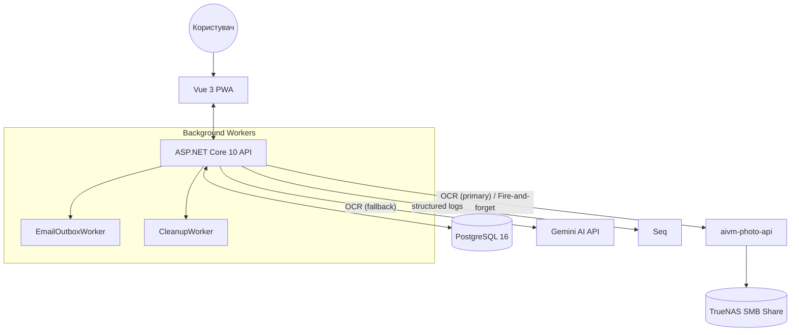

# BP Tracker — Backend

REST API для системи відстеження артеріального тиску. Виконує OCR знімків тонометра локально через `aivm-photo-api` (з резервним fallback на Gemini AI) та асинхронно пересилає фото у сервіс збору датасету для подальшого навчання моделей.

## Архітектура системи



## Як працює один запит

Приклад — додавання вимірювання з фото:

1. **Фронтенд** робить фото через камеру, стискає його (~1024px довша сторона, JPEG 0.85) і відправляє `POST /api/v1/measurements/analyze` (multipart, поле `image`).

2. **SessionMiddleware** читає `__Host-session` cookie, валідує сесію в БД, наповнює `HttpContext.User`. Без валідної сесії — 401.

3. **AnalyzeEndpoints** запускає OCR-пайплайн:
   - Якщо `PHOTO_API_ENABLED=true` — `PhotoApiService.RecognizeAsync()` шле синхронний HTTP-запит на `aivm-photo-api/images/recognize` (таймаут 5с). При успіху повертається `{sys, dia, pulse, confidence, source: "local"}`.
   - Якщо local OCR недоступний, повернув помилку або вимкнений — лог `Warning "Local recognition unavailable or failed, falling back to Gemini"`, виклик Gemini API. Результат: `{sys, dia, pulse, confidence: null, source: "gemini"}`.
   - Якщо обидва не доступні — 422 з повідомленням про невдачу.

4. **Фронтенд** показує користувачу `{sys, dia, pulse}` для підтвердження. Користувач може виправити значення.

5. При підтвердженні — `POST /api/v1/measurements/with-photo` (multipart): поля `image`, `sys`, `dia`, `pulse`, опційно `geminiSys`/`geminiDia`/`geminiPulse` (історична назва — насправді AI-підказка незалежно від джерела), `sourceEngine` (`"local"`/`"gemini"`).

6. **MeasurementEndpoints** валідує діапазони (sys 40-300, dia 20-200, pulse 30-250), зберігає замір у БД через `MeasurementService.CreateAsync()`, повертає 201 користувачу.

7. **Після відповіді** (fire-and-forget) — `PhotoApiService.UploadAsync()` шле фото + метадані на `aivm-photo-api/images/upload` для архіву датасету. Збій upload логується, але не впливає на користувача (замір вже в БД).

Структуровані логи кожного кроку доступні в Seq — спільні поля для трасування одного запиту: `RequestPath`, `user_id`, `request_id`, `ConnectionId`.

## Стек

- **.NET 10** Minimal APIs
- **PostgreSQL 16** + Entity Framework Core 10.0 (Npgsql)
- **Fido2NetLib** — Passkey (WebAuthn) автентифікація
- **MailKit** — відправка email (magic link, CSV export)
- **Serilog** — структуроване JSON-логування + Seq sink
- **Scalar UI** — інтерактивна документація (`/scalar/v1`)
- **Docker + Docker Compose** — розгортання
- **aivm-photo-api** — основний OCR (локальна YOLOv8-модель)
- **Gemini AI** — резервний OCR (fallback)

## Логи

Структуровані JSON-логи через Serilog. Перегляд — через Seq на http://treehouse.lan:5341 (локальна мережа).

В Seq доступні фільтри по полях: `RequestPath`, `user_id`, `request_id`, `SourceContext`,
а також по будь-якому полю обʼєктів, що логуються з `{@...}` синтаксисом.

Корисні запити:
- `RequestPath = '/api/v1/measurements/analyze'` — всі OCR-запити
- `@Level = 'Warning'` — попередження (наприклад, fallback на Gemini)
- `Result.Source = 'gemini'` — запити, що пішли через Gemini fallback
- `SourceContext like 'BpTracker%'` — тільки прикладні логи (без шуму від EF/ASP.NET)

INFO-логи Microsoft.* стеку відфільтровані до Warning у `Program.cs` через `MinimumLevel.Override` — щоб SQL-запити EF Core і per-request трасування ASP.NET не засмічували Seq.

## Структура проекту

```
├── Data/               AppDbContext, EF Core migrations
├── Models/             Measurement, TreatmentSchema, User, UserSetting,
│                       UserCredential, UserSession, MagicLink, EmailOutbox
├── Services/           IMeasurementService, ISchemaService, IGeminiService,
│                       IAuthService, IEmailSender, IPhotoApiService,
│                       EmailOutboxWorker, CleanupWorker
├── BpTracker.Api.Tests/ Інтеграційні тести (xUnit + Testcontainers)
├── Endpoints/          MeasurementEndpoints, SchemaEndpoints, AnalyzeEndpoints,
│                       AuthEndpoints, SettingsEndpoints, ExportEndpoints
├── Middleware/         SessionMiddleware (читає __Host-session cookie → HttpContext.User)
├── Program.cs          Startup, DI, CORS, Rate Limiting, Serilog, автоміграції, UseForwardedHeaders (X-Forwarded-For/Proto від Cloudflare Tunnel)
└── Dockerfile          Multi-stage build (sdk → publish → runtime)
```

## API Endpoints

### Health
| Метод | URL | Опис |
|---|---|---|
| `GET` | `/api/v1/health` | Стан БД, aivm-photo-api та Gemini API |

### Auth
| Метод | URL | Опис |
|---|---|---|
| `GET` | `/api/v1/auth/me` | Поточний користувач (сесія) |
| `POST` | `/api/v1/auth/logout` | Вихід (видаляє сесію) |
| `POST` | `/api/v1/auth/passkey/register/begin` | Ініціює реєстрацію Passkey |
| `POST` | `/api/v1/auth/passkey/register/complete` | Завершує реєстрацію Passkey |
| `POST` | `/api/v1/auth/login/begin` | Ініціює вхід через Passkey |
| `POST` | `/api/v1/auth/login/complete` | Завершує вхід через Passkey |
| `POST` | `/api/v1/auth/magic-link/request` | Надсилає magic link на email (rate limit: 3/15хв) |
| `POST` | `/api/v1/auth/magic-link/consume` | Споживає magic link `{token}` → встановлює сесію |

### Measurements (потребує авторизації)
| Метод | URL | Опис |
|---|---|---|
| `GET` | `/api/v1/measurements?days=90` | Вимірювання за N днів (default 90, max 365) |
| `POST` | `/api/v1/measurements` | Додати вимірювання `{sys, dia, pulse}` (JSON) |
| `POST` | `/api/v1/measurements/with-photo` | Додати замір з фото (`multipart/form-data`). Поля: `image`, `sys`, `dia`, `pulse`, `geminiSys`, `geminiDia`, `geminiPulse` (історична назва — AI-підказка незалежно від джерела), `sourceEngine` (`"local"`/`"gemini"`). Зберігає в БД та асинхронно шле в photo-api. |
| `DELETE` | `/api/v1/measurements/{id}` | Видалити вимірювання |
| `POST` | `/api/v1/measurements/analyze` | OCR фото тонометра → `{sys, dia, pulse, source, confidence}` (rate limit: 10/хв). `source` = `"local"` або `"gemini"`. `confidence` для local — мін. впевненість серед розпізнаних цифр, для gemini — `null`. |

### Settings (потребує авторизації)
| Метод | URL | Опис |
|---|---|---|
| `GET` | `/api/v1/settings` | Отримати налаштування (створює рядок при першому GET) |
| `PATCH` | `/api/v1/settings` | Оновити налаштування `{exportEmail, geminiUrl}` |

### Export (потребує авторизації)
| Метод | URL | Опис |
|---|---|---|
| `POST` | `/api/v1/export/csv` | Поставити CSV у чергу на відправку (rate limit: 1/10хв) |

### Schemas
| Метод | URL | Опис |
|---|---|---|
| `GET` | `/api/v1/schemas/active` | Активна схема лікування (публічний) |
| `GET` | `/api/v1/schemas` | Список усіх схем (потребує авторизації) |
| `POST` | `/api/v1/schemas` | Створити схему {doctor, prescribedOn?, schedule, setActive} (авторизація) |
| `PUT` | `/api/v1/schemas/{id}` | Оновити схему (авторизація) |
| `POST` | `/api/v1/schemas/{id}/activate` | Зробити схему активною (авторизація) |

Активною може бути максимум одна схема; `setActive` при створенні та `activate` атомарно (в транзакції) знімають прапорець з попередньої активної.

Інтерактивна документація (dev mode): `http://localhost:5000/scalar/v1`

## Зовнішні залежності

### aivm-photo-api
Локальний ML-сервіс. Виконує дві ролі:
- **Основний OCR** — на ендпоінті `/measurements/analyze` бекенд шле синхронний запит на `/images/recognize`. YOLOv8-пайплайн розпізнає цифри з фото тонометра на CPU (~50 мс).
- **Збір датасету** — при `/measurements/with-photo` бекенд асинхронно (через `PhotoApiService`, fire-and-forget) пересилає фото + метадані на `/images/upload`. Файли йдуть на SMB-mounted NAS share.

Тонкощі:
- **Стійкість:** Збої `photo-api` логуються. При відмові розпізнавання — fallback на Gemini. При відмові upload — замір все одно зберігається для користувача в БД.
- **Таймаут:** 5 секунд на запит до photo-api. Якщо не відповідає — на Gemini.
- **Вимкнення:** `PHOTO_API_ENABLED=false` пропускає local-крок повністю і йде одразу на Gemini.

Змінні: `PHOTO_API_ENABLED`, `PHOTO_API_URL`, `PHOTO_API_TOKEN`, `PHOTO_API_DEVICE_MODEL`.

Документація: [../aivm-photo-api/README.md](../aivm-photo-api/README.md)

### Gemini AI
Резервний (fallback) OCR. Викликається коли local недоступний, повернув помилку або вимкнений.
- **Змінні:** `GEMINI_API_KEY`, `GEMINI_MODEL`.
- **Ліміти:** 10 запитів на хвилину на користувача.

### Seq
Локальний агрегатор структурованих логів. Працює на сусідньому контейнері (порт 5341). Бекенд пише туди через `Serilog.Sinks.Seq`. Консольний sink залишений як страховка (`docker logs` все ще працює).

### Frontend
SPA застосунок на Vue 3, що є єдиним клієнтом цього API.
Документація: [../bptracker-frontend/README.md](../bptracker-frontend/README.md)

## Змінні оточення

| Змінна | Обов'язкова | За замовчуванням | Опис |
|---|---|---|---|
| `POSTGRES_PASSWORD` | Так | — | Пароль PostgreSQL |
| `GEMINI_API_KEY` | Так | — | API ключ Google Gemini |
| `GEMINI_MODEL` | Ні | `gemini-flash-latest` | Назва моделі Gemini |
| `ALLOWED_EMAILS` | Ні | — | Список дозволених email-адрес (через кому) для входу. Якщо порожній або відсутній — вхід заборонений для всіх. |
| `CORS_ORIGINS` | Ні | `https://bptracker.home.vn.ua` | Дозволені origins (через кому) |
| `FIDO2_DOMAIN` | Ні | `bptracker.home.vn.ua` | Domain для Passkeys (RP ID) |
| `ASPNETCORE_ENVIRONMENT` | Ні | `Production` | `Production` або `Development` |
| `APP_URL` | Ні | `https://bptracker.home.vn.ua` | URL фронтенду (для magic link в email) |
| `SEQ_URL` | Ні | `http://seq:80` | URL Seq ingestion endpoint (всередині docker network) |
| `SMTP_HOST` | Ні | — | SMTP сервер |
| `SMTP_PORT` | Ні | `587` | SMTP порт (587 = StartTLS, 465 = SSL) |
| `SMTP_USER` | Ні | — | SMTP логін |
| `SMTP_PASSWORD` | Ні | — | SMTP пароль / app password |
| `SMTP_FROM` | Ні | — | Адреса відправника |
| `SMTP_FROM_NAME` | Ні | `BP Tracker` | Ім'я відправника |
| `SMTP_TLS` | Ні | `true` | StartTLS для порту 587 |
| `PHOTO_API_ENABLED` | Ні | `false` | Увімкнути локальний ML-сервіс (основний шлях OCR + збір датасету). Якщо вимкнено — OCR іде напряму через Gemini. |
| `PHOTO_API_URL` | Так* | — | URL сервісу aivm-photo-api (*якщо увімкнено) |
| `PHOTO_API_TOKEN` | Так* | — | Bearer token для aivm-photo-api (*якщо увімкнено) |
| `PHOTO_API_DEVICE_MODEL` | Ні | `Paramed Expert-X` | Модель приладу для метаданих |

### Файли конфігурації

Для налаштування середовища використовуються такі файли:
1. `.env` — змінні для продакшену (ігнорується Git).
2. `.env.example` — зразок заповнення, містить вичерпний перелік змінних, необхідних для запуску додатка (публікується в Git).
3. `.env.local.dev` — конфігураційні змінні для локальної розробки (ігнорується Git).

## Безпека

- **Автентифікація:** HttpOnly `__Host-session` cookie (Secure, SameSite=Lax). Passkeys через `Fido2NetLib`. Magic link — SHA-256 хеш у БД, TTL 15 хв.
- **Проксі та HTTPS:** `UseForwardedHeaders` в `Program.cs` читає `X-Forwarded-For` / `X-Forwarded-Proto` від Cloudflare Tunnel, щоб ASP.NET Core коректно визначав HTTPS-схему (необхідно для `Secure` cookie та WebAuthn RP ID).
- **Інвалідація сесій:** при кожному логіні видаляються всі сесії цього користувача старіші за 90 днів.
- **CORS:** дозволено лише origins з `CORS_ORIGINS` + `.AllowCredentials()`
- **Rate limiting:** `/measurements/analyze` та `/measurements/with-photo` — 10 req/хв per user; `/magic-link/request` — 3 req/15хв per email; `/export/csv` — 1 req/10хв per user.
- **Ізоляція даних:** всі запити вимірювань фільтруються по `UserId` поточної сесії.
- **Обробка помилок:** глобальний `UseExceptionHandler` → RFC 7807 ProblemDetails.

## Валідація даних

PostgreSQL CHECK constraints + Data Annotations:
- Систолічний: 40–300
- Діастолічний: 20–200
- Пульс: 30–250

## Тести

Інтеграційний набір у `BpTracker.Api.Tests/`. Потребує Docker Desktop (Testcontainers піднімає `postgres:16` автоматично).

```bash
cd bptracker-backend
# Запустити всі тести (потребує Docker)
dotnet test

# Запустити тільки юніт-тести (без Docker)
dotnet test --filter PhotoApiServiceTests
```

Покриває: auth (magic link, session), measurements (CRUD, IDOR, with-photo), export (outbox, rate limit), health, photo-api service (upload, recognize: local success, fallback на Gemini, обидва fail, disabled short-circuit), schemas (CRUD, інваріант "активна рівно одна", валідація розкладу, Amount-as-string, unicode).

## Локальна розробка

**Потрібно:** .NET 10 SDK, Docker, `dotnet-ef` (`dotnet tool install -g dotnet-ef`)

```bash
# Запустити БД
docker-compose up db -d

# Запустити API (міграції застосуються автоматично)
GEMINI_API_KEY=your_key dotnet run --project BpTracker.Api.csproj
```

```bash
# Нова міграція після зміни моделей
dotnet ef migrations add <Name> --project BpTracker.Api.csproj
```

## Docker розгортання

Розгортання — вручну на сервері командами нижче.

> Раніше деплой був автоматизований через Portainer GitOps Webhook на гілку `main`.
> Webhook вимкнено — авто-деплой спрацьовував надто неявно; тепер розгортання свідоме й ручне.

```bash
cp .env.example .env
# відредагувати .env
docker-compose up --build -d
```

Стек:
- `api` — порт 5000
- `db` — PostgreSQL на 5436
- `seq` — Seq UI на 5341

## Бекапи БД

Автоматичний бекап (контейнер `pg-backup`) було прибрано як зайвий. Для ручного бекапу:

```bash
# Створити бекап
docker exec bptracker-db pg_dump -U bp_user bp_tracker | gzip > backup-$(date +%Y%m%d).sql.gz

# Відновити
docker compose stop api
gunzip -c backup-YYYYMMDD.sql.gz | docker exec -i bptracker-db psql -U bp_user bp_tracker
docker compose start api
```

Альтернативи на майбутнє: ZFS-снапшоти на TrueNAS для папки де лежить Postgres volume, або періодичний `cron` хоста з командою вище.

## Notes for code agents

### Точки входу для агента
- **Додати ендпоінт:** створити/оновити клас у `Endpoints/`, додати метод розширення та зареєструвати його у `Program.cs`.
- **Зміна БД:** оновити модель у `Models/`, виконати `dotnet ef migrations add <Name> --project BpTracker.Api.csproj`. Міграції застосовуються автоматично при старті.
- **Бізнес-логіка:** переважно у `Services/`. Використовуйте DI (Constructor Injection).

### Конвенції найменування
- **C#:** PascalCase для класів, методів та публічних властивостей. camelCase для приватних полів (з префіксом `_`).
- **JSON:** camelCase (стандарт System.Text.Json).
- **Database:** PascalCase для імен таблиць та колонок (стандарт EF Core).

### Відомий технічний борг (Tech Debt)
- **CSRF:** наразі відсутній спеціальний middleware для CSRF захисту (частково нівелюється `SameSite=Lax` та `Custom Header` вимогами).
- **Cleanup:** `CleanupWorker` видаляє старі сесії, але наразі немає автоматичного очищення "Dead" листів у `EmailOutbox`.
- **Files:** фотографії обробляються в пам'яті (`MemoryStream`), що може бути неефективним для дуже великих файлів при високому навантаженні.
- **Семантика form fields:** поля `geminiSys/geminiDia/geminiPulse` у `/measurements/with-photo` — історична назва. Семантично це "AI suggestion" незалежно від двигуна. Не перейменовано для уникнення синхронної зміни фронтенду.

### Додатково
- **Session context:** `HttpContext.User` заповнюється у `Middleware/SessionMiddleware.cs`. Клайм `NameIdentifier` містить `Guid` користувача.
- **API Versioning:** всі маршрути починаються з `/api/v1/`.
- **Database:** використовується `Npgsql.EntityFrameworkCore.PostgreSQL`. `TreatmentSchema.Id` — `Guid` (раніше був рядок «лікар+дата»; мігровано в `SchemaMetadata`). Поля: `Doctor` (text), `PrescribedOn` (date), `CreatedAt` (timestamptz, default now()), `IsActive` (bool), `ScheduleDocument` (`JsonDocument?`, jsonb). Формат `ScheduleDocument`: обʼєкт із ключами `Morning`/`Day`/`Evening`, кожен — масив `{Amount, Medicine, Condition}`, усі значення рядки (зокрема `Amount` — рядок, напр. `"0.5"`). У БД ключі канонічний PascalCase; вхід API приймає їх case-insensitive і нормалізує. Звʼязку (FK) з `Users` немає — схема глобальна.
- **Логування:** Serilog → Console + Seq. INFO-логи `Microsoft.*` стеку відфільтровані до Warning для зменшення шуму. Власні логи писати через `ILogger<T>` injection. Для структурованих обʼєктів — `{@Obj}` синтаксис.
